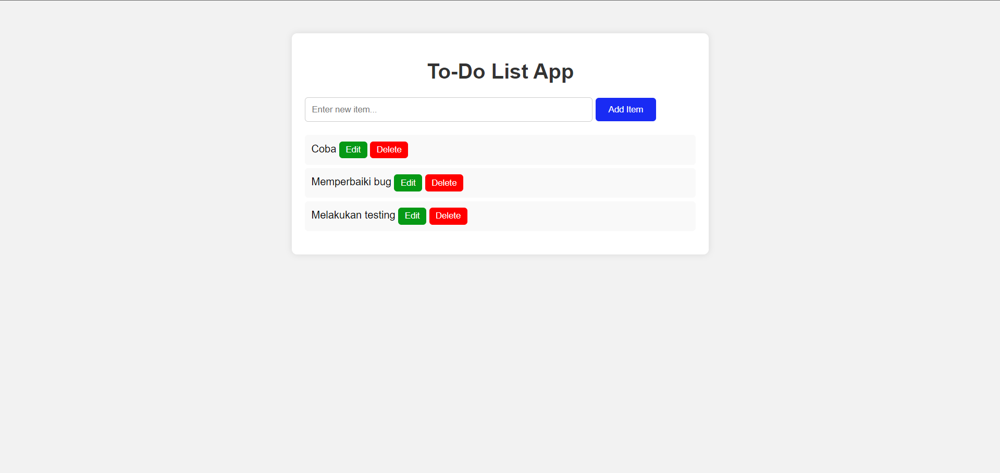

# To-do_List_App
Hi, let me introduce myself, Ika Nurfitriani! This repository contains source code for creating a to-do list application using Python with HTML and CSS. This application is useful for helping determine activities to be carried out at work or in daily life.

# Screenshot Aplikasi
The following is a screenshot of the To-Do List application:

## Author
[@Ika Nurfitriani](https://github.com/ikanurfitriani)